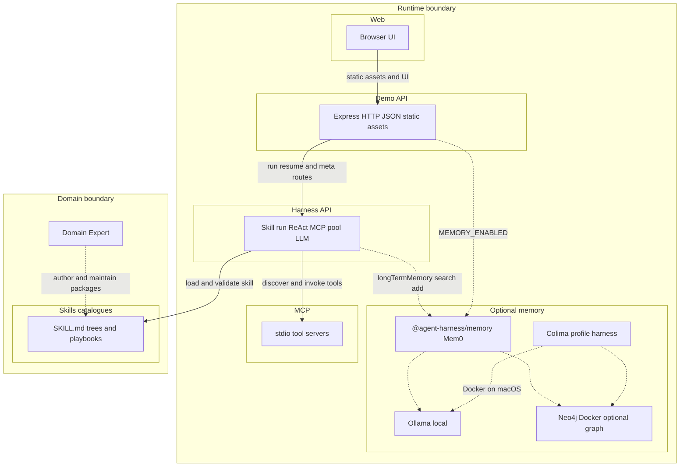
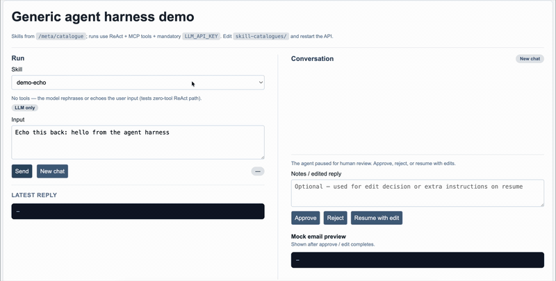

# AI Harness

## Objective

This repo demonstrates that a **skill is a portable package**: a `SKILL.md` file that declares instructions, tool bindings, and HITL policy. The **AI Harness** is a domain-agnostic engine that loads any such package and runs it. The same orchestration pipe serves an echo test, a property cold-call flow, and a multi-step evidence workflow—showing that **skills are the unit of capability**, not the harness.

## Design thinking

1. **Orchestration is the first-order component** — It contains no domain intelligence. It builds the execution pipe: LLM loop, MCP tool dispatch, thread memory, HITL pause/resume. It is the same pipe regardless of which skill is loaded.

2. **Skill is the higher-order component** — A `SKILL.md` *configures* the pipe by injecting capability: which MCP tools to bind, what instructions to follow, whether HITL is required, how to branch. A skill is a self-contained package you add to the catalogue.

3. **Agent = orchestration (execution) + skill (capability)** — At runtime, the harness loads a skill by name, wires the declared MCP servers, injects context, and hands control to the LLM loop. The skill shapes what the agent *does*; the orchestration shapes *how* it runs.

## Out of scope

This repository is a **demonstration harness**, not a production platform:

- **Default memory** — Run and thread state are **in-memory** for the demo (LangGraph checkpointer). There is no production-grade retention or eviction policy for that path.
- **Optional long-term memory** — The separate package `@agent-harness/memory` (Mem0 OSS + local Ollama + optional Neo4j) adds **semantic** recall when you opt in (`MEMORY_ENABLED=true` and local infra). That path is still a PoC, not a production memory platform. See [packages/memory/README.md](packages/memory/README.md).
- **Observability** — The code may emit **structured logs** for local debugging (and optional CloudWatch wiring), but **full observability**—distributed tracing, metrics, SLOs, centralized log pipelines, and alerting—is not a goal of this PoC.

## Architecture

Runtime flow reads **left to right** inside the **Runtime boundary**. **Skills catalogues** and the **Domain Expert** sit in the **Domain boundary** (authoring and definitions); the two boundaries are stacked so they do not overlap in the diagram.



## Demo



Full-quality screen recording (with audio, if any): [`assets/ai-harness-demo.mov`](assets/ai-harness-demo.mov). The loop above is the same demo as [`assets/ai-harness-demo.gif`](assets/ai-harness-demo.gif) for inline viewing on GitHub.

## Skill complexity matrix

| Use case             | Skill                         | MCP server        | Tools used                     | HITL | Complexity                                                                     | Effort to replicate                                                            | Notes                                                       |
| -------------------- | ----------------------------- | ----------------- | ------------------------------ | ---- | ------------------------------------------------------------------------------ | ------------------------------------------------------------------------------ | ----------------------------------------------------------- |
| Echo / smoke test    | `demo-echo`                   | none              | 0                              | no   | Low — no MCP, pure LLM                                                        | Low — single SKILL.md, no tool wiring                                         | Baseline: proves the pipe works end-to-end                  |
| Web research         | `web-research`                | mcp-tools-generic | `web_search`, `text_transform` | no   | Low — 2 generic stubs                                                         | Low — SKILL.md + existing tools                                               | Adds MCP but linear flow, no branching                      |
| Data analysis        | `data-analysis`               | mcp-tools-generic | `database_query`, `calculate`  | yes  | Medium — MCP + HITL gate                                                      | Medium — must handle approval/reject resume cycle                             | First skill that exercises the HITL boundary                |
| Property touchpoint  | `property-listing-touchpoint` | mcp-tools-generic | 5 property tools               | no   | Medium — branching on classifier output                                       | Medium — 5 new stub tools + conditional SKILL.md                              | Demonstrates interest-based branching without HITL          |
| Support intake       | `support-intake-router`       | mcp-tools-generic | 4 support tools                | no   | Medium — 3-way category routing                                               | Medium — 4 new stub tools + triage logic in SKILL.md                          | Demonstrates multi-branch routing pattern                   |
| Evidence-gated reply | `evidence-gated-reply`        | mcp-mock-workflow | 6 workflow tools               | yes  | High — dedicated MCP server, multi-step gather/rank, HITL, context enrichment | High — separate MCP app, fixture data, run-context strategy, 6 stateful tools | Full-stack example: custom MCP + fixtures + HITL + strategy |
| Journey: job intake  | `job-interview-recruiter`     | none              | 0                              | no   | Low — LLM-only persona + fixture enrichment                                   | Low — SKILL.md + `memory-entity-domain: journey`                              | Recruiter intake; Mem0 `entityId` `user-*-journey`          |
| Journey: property    | `property-search-consult`     | none              | 0                              | no   | Low — LLM-only                                                                | Low                                                                           | Property search consult                                       |
| Journey: mortgage    | `mortgage-planning-consult`    | none              | 0                              | no   | Low — LLM-only                                                                | Low                                                                           | Finance / mortgage coach                                      |
| Journey: analytics   | `person-journey-analytics`    | none              | 0                              | no   | Low — synthesizes **Long-term memory** block                                  | Low                                                                           | Cross-domain summary from memory                              |

**Memory domains:** skills set `memory-entity-domain: journey` or `legacy` in `SKILL.md`. With `MEMORY_ENABLED=true` and `fixture-enrichment`, the API resolves **`entityId`** like `user-5001-journey` vs `user-5001-legacy` so graph/vector data stay separated per domain.

## Prerequisites

- **Node.js** >= 18
- **Optional Dev Container** — [`.devcontainer/`](.devcontainer/) provides Node, Ollama, and Neo4j for Mem0. See [packages/memory/README.md](packages/memory/README.md).
- **Docker** — Required for the memory POC (`pnpm run memory:up`). Use Docker Desktop or [Colima](https://github.com/abiosoft/colima); see [Memory (optional)](#memory-optional) for a one-line Colima example.
- **pnpm** — This monorepo uses [pnpm](https://pnpm.io/) workspaces. Enable via [Corepack](https://nodejs.org/api/corepack.html): `corepack enable` (Node 16.13+), then installs use the version pinned in root `package.json` (`packageManager`). Root [`.npmrc`](.npmrc) sets `public-hoist-pattern[]=*` so running `node dist/apps/demo-api/server.js` from the repo root (as in `pnpm run start` / `pnpm run dev`) resolves packages the same way as under npm’s hoisted layout.

| Variable | Purpose |
| -------- | ------- |
| `LLM_ENDPOINT` | OpenAI-compatible API base URL (default `https://api.openai.com/v1`) |
| `LLM_API_KEY` | API key (required for demo-api startup) |
| `LLM_MODEL` | Model id (default `gpt-4o-mini`) |
| `PORT` | HTTP port (default `4010`) |
| `MEMORY_ENABLED` | Optional: set `true` to enable Mem0 long-term memory (Ollama for **embeddings**; Mem0 **inference** uses `LLM_ENDPOINT` / `LLM_API_KEY` unless `MEM0_LLM_PROVIDER=ollama`). Neo4j optional for graph. |
| `OLLAMA_URL` | Optional: Ollama base URL for Mem0 **embeddings** (default `http://127.0.0.1:11434`). |
| `NEO4J_URL` | Optional: e.g. `bolt://localhost:7687` — when set, graph memory is enabled unless `MEM0_GRAPH_ENABLED=false`. |
| `NEO4J_USERNAME` / `NEO4J_PASSWORD` | Optional: Neo4j credentials (compose example uses password `harness-memory-local`). |
| `MEM0_GRAPH_ENABLED` | Optional: `true` / `false` to force graph on or off. |
| `HARNESS_CW_LOG_GROUP` | Optional: with `AWS_REGION`, also emit JSON lines to CloudWatch |
| `HARNESS_CW_STREAM_PREFIX` | Optional: CloudWatch stream prefix (default `harness-demo-local`) |
| `AWS_REGION` | Optional: required with `HARNESS_CW_LOG_GROUP` for CloudWatch |

## Quick start

```bash
pnpm install
pnpm run build
pnpm run dev
```

Open [http://localhost:4010](http://localhost:4010).

### Memory (optional)

Mem0 needs **Ollama** (embeddings), **LLM gateway** credentials for Mem0 inference (same as demo-api), and optionally **Neo4j** (graph memory). From the repo root:

| Script | What it does |
| ------ | ---------------- |
| `pnpm run colima:start` | `colima start -p harness -c 2 -m 8 -d 60` (macOS/Linux Docker VM). |
| `pnpm run colima:stop` | `colima stop -p harness`. |
| `pnpm run memory:up` | `docker context use colima-harness` (ignored if the context is missing), then start **Ollama** + **Neo4j** via `docker-compose`. |
| `pnpm run memory:down` | Stop those services. |
| `pnpm run dev:memory` | Same as `pnpm run dev` with `MEMORY_ENABLED=true`. |

**Typical flow**

1. **Colima:** `pnpm run colima:start`. **Docker Desktop:** skip; `memory:up` still runs (context switch no-ops).
2. `pnpm run memory:up`
3. Pull models once (replace container name from `docker ps` if differs):

   ```bash
   docker exec -it devcontainer-ollama-1 ollama pull nomic-embed-text:latest
   docker exec -it devcontainer-ollama-1 ollama pull llama3.1:8b
   ```

4. Run the API:

   ```bash
   export NEO4J_URL=bolt://localhost:7687 NEO4J_PASSWORD=harness-memory-local
   pnpm run dev:memory
   ```

**Host Ollama (optional):** only Neo4j in Docker — `docker-compose -f .devcontainer/docker-compose.neo4j.yml up -d` ([packages/memory/README.md](packages/memory/README.md)).

Diagrams and env reference: [packages/memory/README.md](packages/memory/README.md).

Screen recording of the demo UI: [`assets/ai-harness-demo.mov`](assets/ai-harness-demo.mov) (GIF preview in [Demo](#demo)).

## Tests

```bash
pnpm test
```
