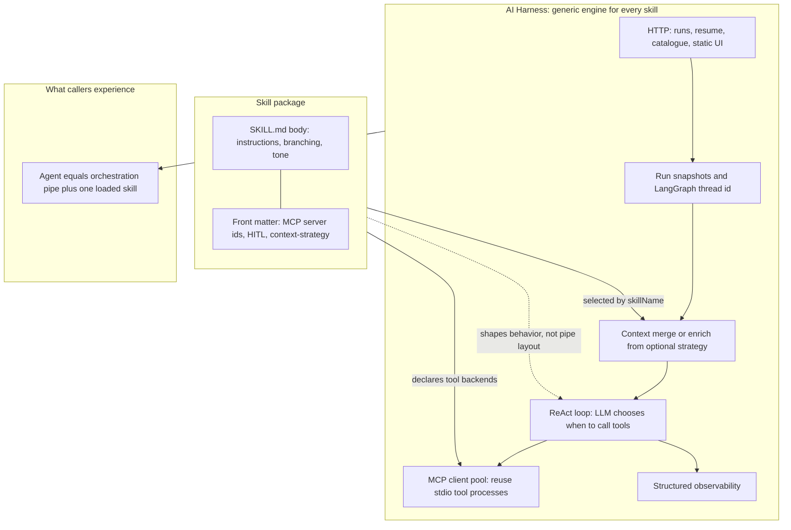

# AI Harness

## Objective

This repo demonstrates that a **skill is a portable package**: a `SKILL.md` file that declares instructions, tool bindings, and HITL policy. The **AI Harness** is a domain-agnostic engine that loads any such package and runs it. The same orchestration pipe serves an echo test, a property cold-call flow, and a multi-step evidence workflow—showing that **skills are the unit of capability**, not the harness.

## Design thinking

1. **Orchestration is the first-order component** — It contains no domain intelligence. It builds the execution pipe: LLM loop, MCP tool dispatch, thread memory, HITL pause/resume. It is the same pipe regardless of which skill is loaded.

2. **Skill is the higher-order component** — A `SKILL.md` *configures* the pipe by injecting capability: which MCP tools to bind, what instructions to follow, whether HITL is required, how to branch. A skill is a self-contained package you add to the catalogue.

3. **Agent = orchestration (execution) + skill (capability)** — At runtime, the harness loads a skill by name, wires the declared MCP servers, injects context, and hands control to the LLM loop. The skill shapes what the agent *does*; the orchestration shapes *how* it runs.

## Architecture

The diagram below matches the design split: generic orchestration pipe (harness), portable skill package, and what the caller experiences at runtime.



## Demo


Full-quality screen recording (with audio, if any): [`assets/ai-harness-demo.mov`](assets/ai-harness-demo.mov). The loop above is the same demo as [`assets/ai-harness-demo.gif`](assets/ai-harness-demo.gif) for inline viewing on GitHub.

## Skill decision matrix

| Use case             | Skill                         | MCP server        | Tools used                     | HITL | Complexity                                                                     | Effort to replicate                                                            | Notes                                                       |
| -------------------- | ----------------------------- | ----------------- | ------------------------------ | ---- | ------------------------------------------------------------------------------ | ------------------------------------------------------------------------------ | ----------------------------------------------------------- |
| Echo / smoke test    | `demo-echo`                   | none              | 0                              | no   | Low — no MCP, pure LLM                                                        | Low — single SKILL.md, no tool wiring                                         | Baseline: proves the pipe works end-to-end                  |
| Web research         | `web-research`                | mcp-tools-generic | `web_search`, `text_transform` | no   | Low — 2 generic stubs                                                         | Low — SKILL.md + existing tools                                               | Adds MCP but linear flow, no branching                      |
| Data analysis        | `data-analysis`               | mcp-tools-generic | `database_query`, `calculate`  | yes  | Medium — MCP + HITL gate                                                      | Medium — must handle approval/reject resume cycle                             | First skill that exercises the HITL boundary                |
| Property touchpoint  | `property-listing-touchpoint` | mcp-tools-generic | 5 property tools               | no   | Medium — branching on classifier output                                       | Medium — 5 new stub tools + conditional SKILL.md                              | Demonstrates interest-based branching without HITL          |
| Support intake       | `support-intake-router`       | mcp-tools-generic | 4 support tools                | no   | Medium — 3-way category routing                                               | Medium — 4 new stub tools + triage logic in SKILL.md                          | Demonstrates multi-branch routing pattern                   |
| Evidence-gated reply | `evidence-gated-reply`        | mcp-mock-workflow | 6 workflow tools               | yes  | High — dedicated MCP server, multi-step gather/rank, HITL, context enrichment | High — separate MCP app, fixture data, run-context strategy, 6 stateful tools | Full-stack example: custom MCP + fixtures + HITL + strategy |

## Prerequisites

- **Node.js** >= 18

| Variable | Purpose |
| -------- | ------- |
| `LLM_ENDPOINT` | OpenAI-compatible API base URL (default `https://api.openai.com/v1`) |
| `LLM_API_KEY` | API key (required for demo-api startup) |
| `LLM_MODEL` | Model id (default `gpt-4o-mini`) |
| `PORT` | HTTP port (default `4010`) |
| `HARNESS_CW_LOG_GROUP` | Optional: with `AWS_REGION`, also emit JSON lines to CloudWatch |
| `HARNESS_CW_STREAM_PREFIX` | Optional: CloudWatch stream prefix (default `harness-demo-local`) |
| `AWS_REGION` | Optional: required with `HARNESS_CW_LOG_GROUP` for CloudWatch |

## Quick start

```bash
npm install
npm run build
npm run dev
```

Open [http://localhost:4010](http://localhost:4010).

Screen recording of the demo UI: [`assets/ai-harness-demo.mov`](assets/ai-harness-demo.mov) (GIF preview in [Demo](#demo)).

## Tests

```bash
npm test
```
