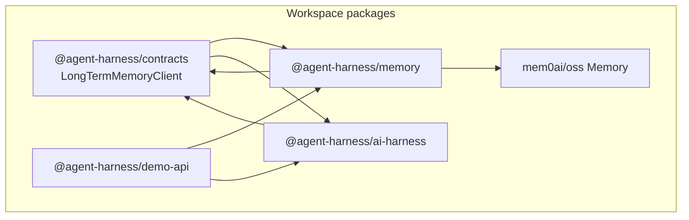
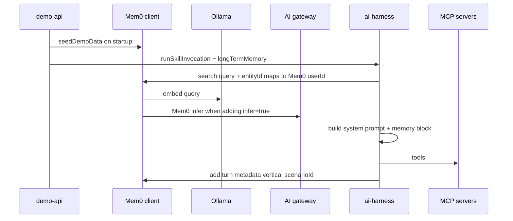
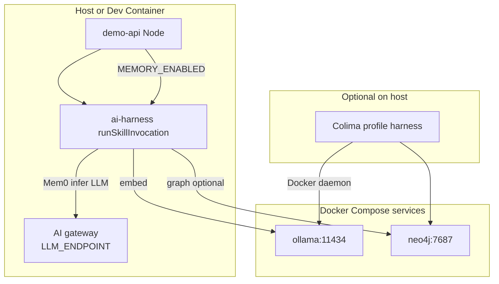

# @agent-harness/memory

Optional **Mem0 OSS** integration for the agent harness: long-term, semantically searchable memory keyed by a stable **`entityId`** (passed through to Mem0 as its `userId` filter), with demo seed data for **legacy** vs **journey** domains aligned to fixture contacts `5001`–`5003`.

## Objective

- Give skills **extra narrative context** beyond the current run (LangGraph `MemorySaver` still handles **thread** state only).
- Demonstrate **one person, partitioned by skill domain**: **`user-5001-legacy`** vs **`user-5001-journey`** (see `memory-entity-domain` on each skill) so hiring demos and journey flows do not share the same Mem0 graph/vector namespace unless you use the same `entityId`.
- Stay **optional**: when `MEMORY_ENABLED` is unset, demo-api and `ai-harness` behave as before.

## Scope (PoC)

- **In-process vector store** via Mem0 (`vectorStore.provider: "memory"`) — vectors die with the Node process.
- **Local Ollama** for **embeddings only** (`nomic-embed-text` by default).
- **AI gateway** (same `LLM_ENDPOINT` / `LLM_API_KEY` as demo-api) for Mem0’s **inference** LLM (fact extraction + memory actions when `infer: true`). Set `MEM0_LLM_PROVIDER=ollama` to use Ollama for Mem0 LLM instead.
- **Neo4j 5** (Docker) for Mem0 **graph memory** when `NEO4J_URL` is set and graph is not explicitly disabled.
- **No** change to MCP fixtures or scenario contracts; memory is **additive**.

Out of PoC scope: production retention, PII classification, multi-tenant isolation beyond `entityId`, hosted Mem0.

---

## Component and dependency view

Shows how this package sits between the demo API, shared contracts, and local infra.



---

## Data architecture: identity and metadata

Fixture **`candidateId`** values (from `adapters-mock` / `candidateContexts.json`) map to harness **`entityId`** strings via **`buildFixtureEntityId(contactId, domain)`** — e.g. `user-5001-legacy` or `user-5001-journey`. The memory client passes that string to Mem0 as **`userId`** (Mem0’s filter name). Memories carry **metadata** (e.g. `vertical`, `scenarioId`, `contactId`) for filtering and debugging.

```mermaid
flowchart LR
  subgraph fixtures [Fixtures]
    c5001["candidateId 5001"]
  end
  subgraph entityIds [Harness entityId]
    e1l["user-5001-legacy"]
    e1j["user-5001-journey"]
  end
  c5001 --> e1l
  c5001 --> e1j
  subgraph store [Mem0 storage]
    vec["In-memory vectors\nephemeral"]
    graph["Neo4j graph\noptional Docker"]
  end
  e1l --> vec
  e1j --> vec
```

---

## Runtime flow: enrich, search, ReAct, persist

When `MEMORY_ENABLED=true` and `longTermMemory` is wired into `SkillRuntimeDeps`, `runSkillInvocation`:

1. Resolves **`entityId`** on the agent context (demo-api `fixture-enrichment` + skill `memory-entity-domain` + `buildFixtureEntityId`).
2. **Searches** Mem0 with the current user turn (or HITL resume text).
3. Injects a **Long-term memory** section into the system prompt (vector hits; plus **Related entities (graph)** when Neo4j is enabled and Mem0 returns triples).
4. Runs the existing ReAct loop and MCP tools.
5. On **completed** runs, **adds** a short user/assistant pair back into Mem0 (best-effort; failures are swallowed).



---

## Lifecycle: what survives restarts

| Asset | Lifecycle |
| ----- | --------- |
| Mem0 in-process vectors | Destroyed when the **Node** process exits |
| Mem0 SQLite history | Default path `.mem0/memory-history.db` under `cwd` (override `MEM0_HISTORY_DB_PATH`); gitignored |
| Neo4j container volume | Persists until `docker-compose down -v` or volume removal |
| Ollama models | Cached in Docker volume `ollama_data` |

---

## Application and infra architecture

**Host:** `pnpm run colima:start` then `pnpm run memory:up` (the latter runs `docker context use colima-harness` when that context exists, then `docker-compose` for Ollama + Neo4j). **Docker Desktop:** start Desktop, then `pnpm run memory:up` only. **Dev Container:** full stack in [`.devcontainer/docker-compose.yml`](../../.devcontainer/docker-compose.yml).



---

## Configuration (environment variables)

| Variable | Purpose |
| -------- | ------- |
| `MEMORY_ENABLED` | Set to `true` in demo-api to construct Mem0 client, seed demo data, and set `longTermMemory` on `SkillRuntimeDeps`. |
| `OLLAMA_URL` | Ollama base URL for **embeddings** (default `http://127.0.0.1:11434`; in devcontainer: `http://ollama:11434`). |
| `MEM0_EMBED_MODEL` | Embed model id (default `nomic-embed-text:latest`). **Deprecated:** `MEM0_OLLAMA_EMBED_MODEL` still works. |
| `MEM0_LLM_PROVIDER` | `openai` (default, OpenAI-compatible gateway) or `ollama` for Mem0 inference LLM. |
| `MEM0_LLM_BASE_URL` | Overrides Mem0 LLM API base (default: `LLM_ENDPOINT`, else `https://api.openai.com/v1`). Ignored when provider is `ollama`. |
| `MEM0_LLM_API_KEY` | Overrides API key for Mem0 LLM (default: `LLM_API_KEY`). Ignored when provider is `ollama`. |
| `MEM0_LLM_MODEL` | Model id for Mem0 inference (default: `LLM_MODEL`, else `gpt-4o-mini`). **Deprecated:** `MEM0_OLLAMA_LLM_MODEL` still works. |
| `MEM0_EMBEDDING_DIMS` | Default `768` (match nomic-embed-text) |
| `MEM0_VECTOR_COLLECTION` | In-memory collection name |
| `MEM0_HISTORY_DB_PATH` | SQLite file for Mem0 memory **history** (ADD/UPDATE/DELETE audit). Default: `.mem0/memory-history.db` under `cwd`. |
| `NEO4J_URL` | e.g. `bolt://localhost:7687` or `bolt://neo4j:7687` |
| `NEO4J_USERNAME` | Default `neo4j` |
| `NEO4J_PASSWORD` | Default `password` (devcontainer compose uses `harness-memory-local`) |
| `MEM0_GRAPH_ENABLED` | `true` / `false`; if unset, graph is on when `NEO4J_URL` is non-empty |

When Neo4j is enabled, **`search`** returns **vector hits** plus **graph triples** (`source` —relationship→ `destination`); ai-harness appends a **Related entities (graph)** subsection to the long-term memory block in the system prompt.

### Gateway JSON mode (Mem0)

Mem0 calls the LLM with `response_format: json_object`. Validate your gateway before relying on memory:

```bash
curl -sS "$LLM_ENDPOINT/chat/completions" \
  -H "Authorization: Bearer $LLM_API_KEY" \
  -H "Content-Type: application/json" \
  -d '{"model":"'"$LLM_MODEL"'","messages":[{"role":"user","content":"Return JSON: {\"ok\":true}"}],"response_format":{"type":"json_object"}}'
```

---

## Debug logging

This package uses the [`debug`](https://www.npmjs.com/package/debug) library. Enable namespaces with the **`DEBUG`** environment variable (not `NODE_DEBUG`). When disabled, log calls are no-ops.

| Namespace | Logs |
| --------- | ---- |
| `harness:llm` | Each Mem0 LLM `generateResponse` (messages summary, `response_format`, truncated response, duration). |
| `harness:embedding` | Each embedder `embed` / `embedBatch` (truncated input, vector dim or batch size, duration). |
| `harness:graph` | Each graph memory `add` / `search` (truncated input, relation/row counts, duration). |
| `harness:mem0` | High-level `add` / `search`, resolved config (LLM provider/model, embedder, graph on/off, **SQLite history DB path**), client construction. |

Examples:

```bash
# One subsystem
DEBUG=harness:llm pnpm run dev:memory

# Several
DEBUG=harness:llm,harness:graph pnpm run dev:memory

# All harness debug (wildcard)
DEBUG=harness:* pnpm run dev:memory
```

### Tail Docker service logs (Neo4j / Ollama)

From the **monorepo root**, default Compose project name `devcontainer` yields containers `devcontainer-neo4j-1` and `devcontainer-ollama-1`:

| Script | Command |
| ------ | ------- |
| `pnpm run logs:neo4j` | `docker logs -f devcontainer-neo4j-1` |
| `pnpm run logs:ollama` | `docker logs -f devcontainer-ollama-1` |
| `pnpm run logs:all` | Follows both (background + `wait`; Ctrl+C stops). |

---

## Quickstart: enable memory for the harness

From the **monorepo root** (same scripts as root `package.json`):

1. `pnpm run colima:start` (Colima only) **or** start Docker Desktop.
2. `pnpm run memory:up` — selects `colima-harness` when present, then starts Ollama + Neo4j.
3. Pull the **embedding** model (required). Pull **`llama3.1:8b`** only if you use `MEM0_LLM_PROVIDER=ollama` for Mem0 inference:

   ```bash
   docker exec -it devcontainer-ollama-1 ollama pull nomic-embed-text:latest
   # Optional: docker exec -it devcontainer-ollama-1 ollama pull llama3.1:8b
   ```

4. Ensure `LLM_API_KEY` / `LLM_ENDPOINT` / `LLM_MODEL` are set for the gateway (same as `pnpm run dev`). `export NEO4J_URL=bolt://localhost:7687 NEO4J_PASSWORD=harness-memory-local` if you want graph memory. Then `pnpm run dev:memory`.
5. Try skill **`evidence-gated-reply`** with **`candidate 5001`** in the input.
6. `pnpm run memory:down` when finished; `pnpm run colima:stop` if you use Colima.

### Optional: host Ollama

To run Ollama on the host and only Neo4j in Docker: [`.devcontainer/docker-compose.neo4j.yml`](../../.devcontainer/docker-compose.neo4j.yml) — `docker-compose -f .devcontainer/docker-compose.neo4j.yml up -d`. Keep default `OLLAMA_URL`; pull models with host `ollama pull …`.

---

## Testing

- `pnpm test` at repo root includes `packages/memory` unit tests.
- If Mem0 fails during `createApp`, the API still starts; fix Ollama/Neo4j/env and restart.

---

## Public API

- `createLongTermMemoryClient()` — async factory returning a `LongTermMemoryClient`.
- `seedDemoData(client)` — loads demo conversations per **`user-{id}-legacy`** and **`user-{id}-journey`** using **`infer: false`** (Mem0 embeds each message; no LLM fact-extraction pass, so startup stays fast).
- `buildFixtureEntityId(contactId, domain)` — maps fixture candidate id + **`journey` \| `legacy`** to `entityId`.
- `buildMemoryConfigFromEnv()` — inspect or reuse Mem0 config.
- `DEMO_SEED_CONVERSATIONS` — raw seed definitions for tests or docs.

Types: `LongTermMemoryClient` and message shapes live in `@agent-harness/contracts`.

---

## References

- [Mem0 docs](https://docs.mem0.ai)
- [Mem0 Node OSS quickstart](https://docs.mem0.ai/open-source/node-quickstart)
- [Graph memory (Neo4j)](https://docs.mem0.ai/open-source/features/graph-memory)
- [Ollama embedder in Mem0](https://docs.mem0.ai/components/embedders/models/ollama)
