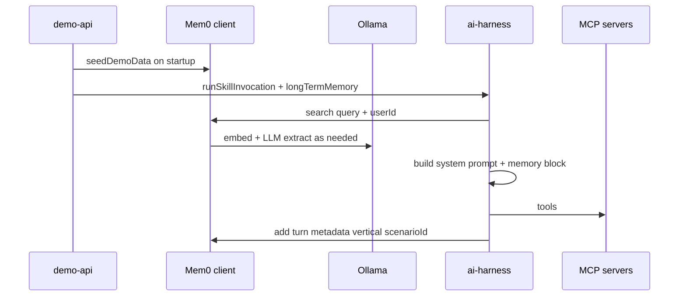
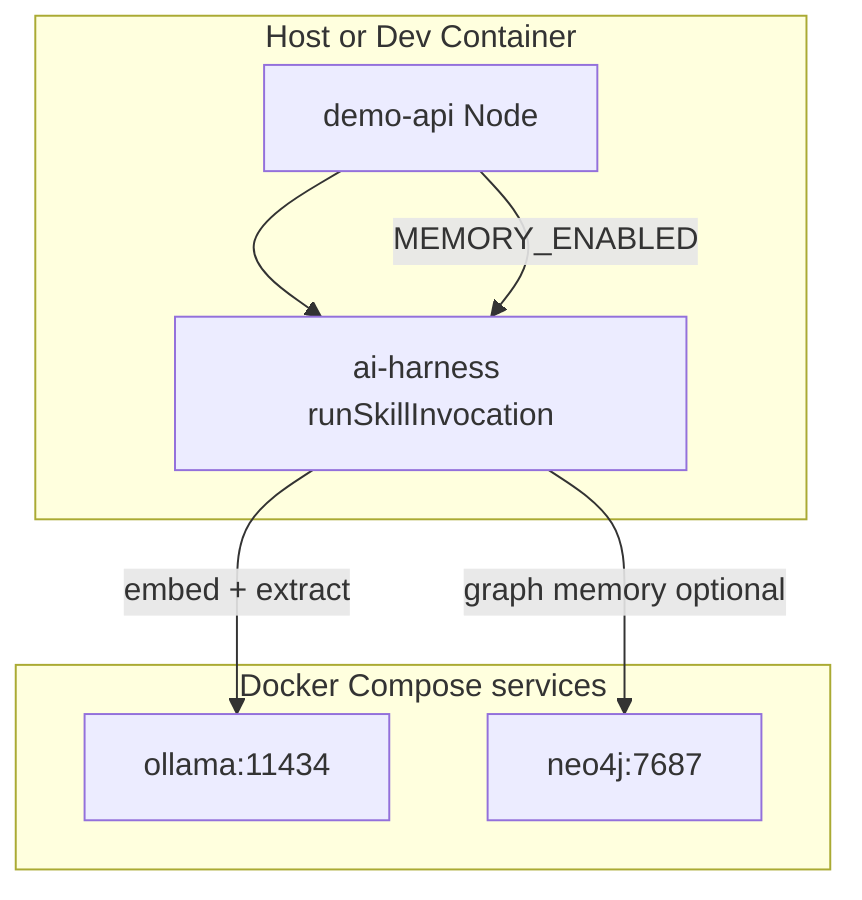

# @agent-harness/memory

Optional **Mem0 OSS** integration for the agent harness: long-term, semantically searchable memory keyed by a stable **`userId`**, with demo **cross-domain** seed data (hiring + fictional property context) aligned to fixture contacts `5001`–`5003`.

## Objective

- Give skills **extra narrative context** beyond the current run (LangGraph `MemorySaver` still handles **thread** state only).
- Demonstrate **one person, two domains**: the same `userId` can surface hiring-related and property-related memories in one search.
- Stay **optional**: when `MEMORY_ENABLED` is unset, demo-api and `ai-harness` behave as before.

## Scope (PoC)

- **In-process vector store** via Mem0 (`vectorStore.provider: "memory"`) — vectors die with the Node process.
- **Local Ollama** for embeddings and for Mem0’s internal extraction LLM (no cloud keys required for Mem0 itself).
- **Neo4j 5** (Docker) for Mem0 **graph memory** when `NEO4J_URL` is set and graph is not explicitly disabled.
- **No** change to MCP fixtures or scenario contracts; memory is **additive**.

Out of PoC scope: production retention, PII classification, multi-tenant isolation beyond `userId`, hosted Mem0.

---

## Component and dependency view

Shows how this package sits between the demo API, shared contracts, and local infra.


---

## Data architecture: identity and metadata

Fixture **`candidateId`** values (from `adapters-mock` / `candidateContexts.json`) map to Mem0 **`userId`** strings. Memories carry **metadata** (e.g. `vertical`, `scenarioId`, `contactId`) for filtering and debugging; search in the harness is currently **by `userId` + query text** (Mem0 semantic search).

```mermaid
flowchart LR
  subgraph fixtures [Fixtures]
    c5001["candidateId 5001"]
    c5002["candidateId 5002"]
    c5003["candidateId 5003"]
  end
  subgraph mem0ids [Mem0 user_id]
    u1["user-5001"]
    u2["user-5002"]
    u3["user-5003"]
  end
  c5001 --> u1
  c5002 --> u2
  c5003 --> u3
  subgraph store [Mem0 storage]
    vec["In-memory vectors\nephemeral"]
    graph["Neo4j graph\noptional Docker"]
  end
  u1 --> vec
  u1 --> graph
```

---

## Runtime flow: enrich, search, ReAct, persist

When `MEMORY_ENABLED=true` and `longTermMemory` is wired into `SkillRuntimeDeps`, `runSkillInvocation`:

1. Resolves **`mem0UserId`** on the agent context (demo-api `fixture-enrichment` strategy + `resolveUserId`).
2. **Searches** Mem0 with the current user turn (or HITL resume text).
3. Injects a **Long-term memory** section into the system prompt (capped list of hits).
4. Runs the existing ReAct loop and MCP tools.
5. On **completed** runs, **adds** a short user/assistant pair back into Mem0 (best-effort; failures are swallowed).



---

## Lifecycle: what survives restarts

| Asset | Lifecycle |
| ----- | --------- |
| Mem0 in-process vectors | Destroyed when the **Node** process exits |
| Mem0 `disableHistory: true` in this PoC | No SQLite history file from Mem0 |
| Neo4j container volume | Persists until `docker compose down -v` or volume removal |
| Ollama models | Cached in Docker volume `ollama_data` |

---

## Application and infra architecture

**Host development:** run Ollama and Neo4j via `npm run memory:up` (starts only those services from `.devcontainer/docker-compose.yml`). **Dev Container:** open the repo in VS Code / Cursor Dev Containers; the `app` service waits for healthy Ollama and Neo4j, with env vars pointing at them.



---

## Configuration (environment variables)

| Variable | Purpose |
| -------- | ------- |
| `MEMORY_ENABLED` | Set to `true` in demo-api to construct Mem0 client, seed demo data, and set `longTermMemory` on `SkillRuntimeDeps`. |
| `OLLAMA_URL` | Ollama base URL (default `http://127.0.0.1:11434`; in devcontainer compose: `http://ollama:11434`). |
| `MEM0_OLLAMA_EMBED_MODEL` | Default `nomic-embed-text:latest` |
| `MEM0_OLLAMA_LLM_MODEL` | Default `llama3.1:8b` |
| `MEM0_EMBEDDING_DIMS` | Default `768` (match nomic-embed-text) |
| `MEM0_VECTOR_COLLECTION` | In-memory collection name |
| `NEO4J_URL` | e.g. `bolt://localhost:7687` or `bolt://neo4j:7687` |
| `NEO4J_USERNAME` | Default `neo4j` |
| `NEO4J_PASSWORD` | Default `password` (devcontainer compose uses `harness-memory-local`) |
| `MEM0_GRAPH_ENABLED` | `true` / `false`; if unset, graph is on when `NEO4J_URL` is non-empty |

---

## Quickstart: enable memory for the harness

1. **Install models** (once per machine / Ollama volume):

   ```bash
   ollama pull nomic-embed-text:latest
   ollama pull llama3.1:8b
   ```

2. **Start Ollama + Neo4j** (from repo root):

   ```bash
   npm run memory:up
   ```

   Set `NEO4J_PASSWORD` / `NEO4J_URL` for your setup. With the provided compose file, use:

   - `NEO4J_URL=bolt://localhost:7687`
   - `NEO4J_USERNAME=neo4j`
   - `NEO4J_PASSWORD=harness-memory-local`

3. **Run the API with memory:**

   ```bash
   export MEMORY_ENABLED=true
   npm run build
   npm run dev
   ```

   Or: `npm run dev:memory` (sets `MEMORY_ENABLED=true` for the dev script).

4. **Exercise a skill** that uses `fixture-enrichment` (e.g. `evidence-gated-reply`) with text that includes **`candidate 5001`** (or `5002` / `5003`). The agent context gains `mem0UserId`; the system prompt gains a **Long-term memory** section from Mem0 search.

---

## Testing and debugging

- **Unit tests:** `resolveUserId` and related pure logic — `npm test` at repo root (includes `packages/memory`).
- **Mem0 / Ollama / Neo4j:** not required for CI; if startup fails, demo-api logs `Long-term memory init failed; continuing without Mem0` and runs without `longTermMemory`.

**Checks:**

- Ollama: `curl -s http://127.0.0.1:11434/api/tags`
- Neo4j Browser: `http://localhost:7474` (when compose exposes it)

**Common issues:**

| Symptom | Likely cause |
| ------- | ------------- |
| Init error mentioning connection | Ollama not running or wrong `OLLAMA_URL` |
| Neo4j connection errors | `NEO4J_URL` / password mismatch with compose |
| Empty long-term block | No seed yet, search miss, or `mem0UserId` missing (wrong skill / no `MEMORY_ENABLED` / no fixture `candidateId`) |
| Slow first run | Mem0 extraction + pulls; seed runs several `add` calls |

---

## Public API

- `createLongTermMemoryClient()` — async factory returning a `LongTermMemoryClient`.
- `seedDemoData(client)` — loads demo conversations per `user-5001` … `user-5003`.
- `resolveUserId(contactId)` — maps fixture candidate id to Mem0 `userId`.
- `buildMemoryConfigFromEnv()` — inspect or reuse Mem0 config.
- `DEMO_SEED_CONVERSATIONS` — raw seed definitions for tests or docs.

Types: `LongTermMemoryClient` and message shapes live in `@agent-harness/contracts`.

---

## References

- [Mem0 docs](https://docs.mem0.ai)
- [Mem0 Node OSS quickstart](https://docs.mem0.ai/open-source/node-quickstart)
- [Graph memory (Neo4j)](https://docs.mem0.ai/open-source/features/graph-memory)
- [Ollama embedder in Mem0](https://docs.mem0.ai/components/embedders/models/ollama)
